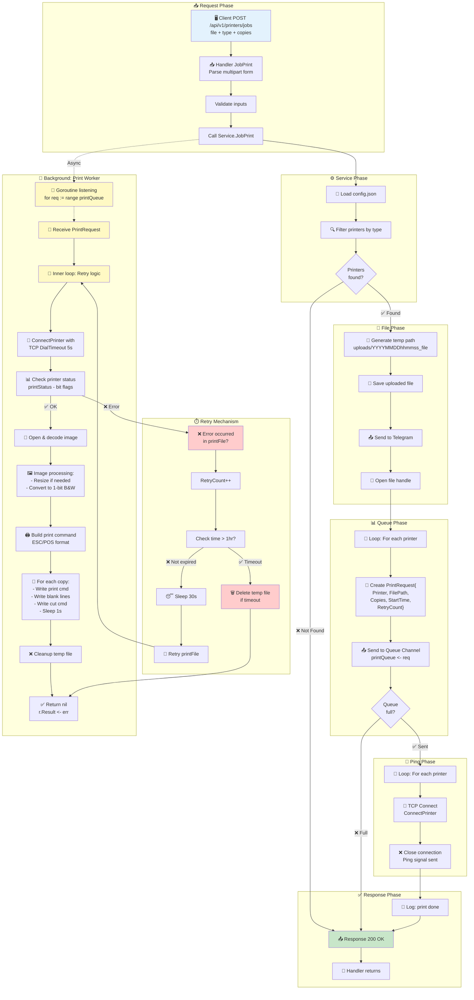
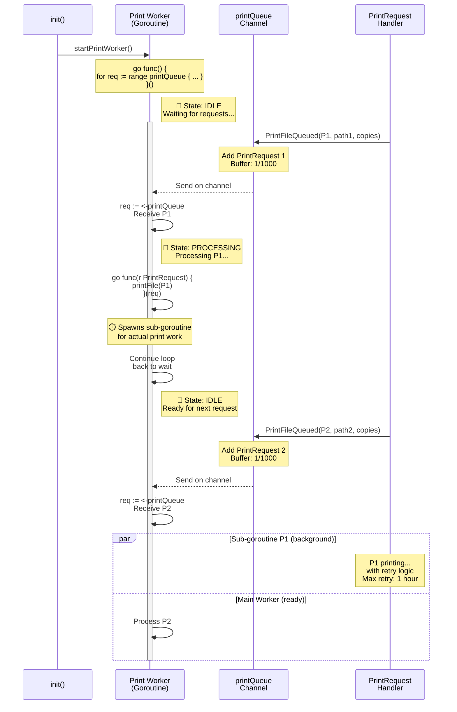
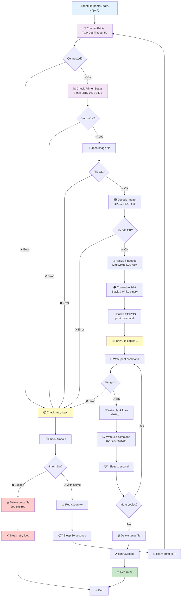
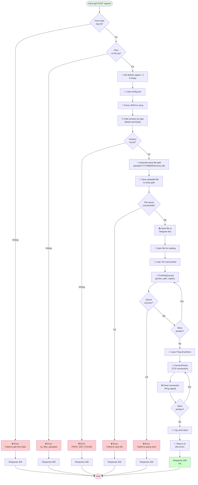

# API Job Print - Flow Diagram

## Overview

API Job Print (`POST /api/v1/printers/jobs`) là endpoint để gửi yêu cầu in một file với các thông số cụ thể.

---

## 🎯 Complete End-to-End Flow (Chi tiết nhất)

---

## 📊 Queue & Worker Processing Flow

---

## 🔄 Queue System Deep Dive

```mermaid
graph LR
    subgraph CLIENT["🖥️ Client Request"]
        R1["Request 1"]
        R2["Request 2"]
        R3["Request N"]
    end

    subgraph HANDLER["📥 Handler Layer"]
        H1["Parse & Validate"]
        H2["Call Service"]
    end

    subgraph SERVICE["⚙️ Service Layer"]
        S1["Load Config"]
        S2["Filter Printers"]
        S3["Save File"]
        S4["Loop: PrintFileQueued<br/>for each printer"]
    end

    subgraph QUEUE["📊 QUEUE CHANNEL<br/>(Buffer Size: 1000)"]
        Q1["PrintRequest 1"]
        Q2["PrintRequest 2"]
        Q3["PrintRequest 3"]
        STATS["Current: 3<br/>Max: 1000"]
    end

    subgraph WORKER["👷 Print Worker<br/>(Single Goroutine)"]
        W1["Waiting..."]
        W2["Processing<br/>Request 1"]
        W3["Processing<br/>Request 2"]
    end

    subgraph PRINTER["🖨️ Printer Operations"]
        P1["TCP Connect"]
        P2["Check Status"]
        P3["Process Image"]
        P4["Send Print Cmd"]
        P5["Wait 1s between copies"]
        P6["Send Cut Command"]
        P7["Close Connection"]
    end

    subgraph RESULT["✅ Results"]
        RES1["r.Result <- nil"]
        RES2["r.Result <- error"]
    end

    CLIENT --> HANDLER
    HANDLER --> SERVICE
    SERVICE --> S1 --> S2 --> S3 --> S4

    S4 -->|Add to Queue| QUEUE
    QUEUE -.->|Non-blocking<br/>send| QUEUE
    QUEUE -->|Channel receive| WORKER

    WORKER --> W2
    W2 --> P1 --> P2
    P2 -->|Status OK| P3 --> P4
    P4 --> P5 --> P6 --> P7
    P7 --> RES1

    P2 -->|Status Error| RES2

    W1 -.->|Waiting for<br/>next request| W3

    style QUEUE fill:#ffeb3b
    style WORKER fill:#fff9c4
    style P1 fill:#e8f5e9
    style P7 fill:#e8f5e9
    style RES1 fill:#c8e6c9
    style RES2 fill:#ffcccc
```

---

## Print Worker Lifecycle

---

## Print File Processing with Retry

---

## Complete Request Lifecycle Timeline

```mermaid
timeline
    title Job Print Request - Complete Timeline

    section Request
        T+0ms: Client sends POST request
        T+5ms: Handler parses form data
        T+10ms: Handler validates input
        T+15ms: Service.JobPrint() called

    section Config
        T+20ms: Load config.json from disk
        T+25ms: Parse JSON config
        T+30ms: Filter printers by type

    section File Operations
        T+40ms: Generate temp file path
        T+45ms: Save uploaded file
        T+50ms: Send file to Telegram
        T+55ms: Open file handle

    section Queue
        T+60ms: Loop - For each printer
        T+65ms: Create PrintRequest object
        T+70ms: Send to queue channel
        T+75ms: Handler returns immediately
        T+80ms: Client receives 200 OK response ✅

    section Ping
        T+85ms: Loop - For each printer
        T+90ms: TCP connect to printer
        T+95ms: Close connection (ping)
        T+100ms: Service returns

    section Background (Worker)
        T+70ms: Worker receives request from queue
        T+75ms: Spawn sub-goroutine for print
        T+100ms: Sub-goroutine connects to printer
        T+105ms: Check printer status
        T+110ms: Decode image file
        T+115ms: Build print command
        T+120ms: Send print command (copy 1)
        T+125ms: Sleep 1 second
        T+126ms: Send print command (copy 2)
        T+131ms: Send cut command
        T+135ms: Delete temp file
        T+140ms: Sub-goroutine completes ✅
```

---

## Flow Chart - Detailed Process

---

## File Locations

| Loại          | Vị trí                            |
| ------------- | --------------------------------- |
| Temp files    | `uploads/YYYYMMDDhhmmss_filename` |
| Config        | `config/config.json`              |
| Device config | `config/device.json`              |

---

## Notes

1. **Copies**: Được gửi tới `PrintFileQueued()` để kiểm soát số bản in
2. **Temp Files**: Lưu với timestamp để tránh trùng tên
3. **Telegram**: Gửi file để logging hoặc monitoring
4. **Ping**: Kết nối TCP cuối cùng để đánh thức printer
5. **Default**: Nếu không có copies → mặc định in 1 bản
