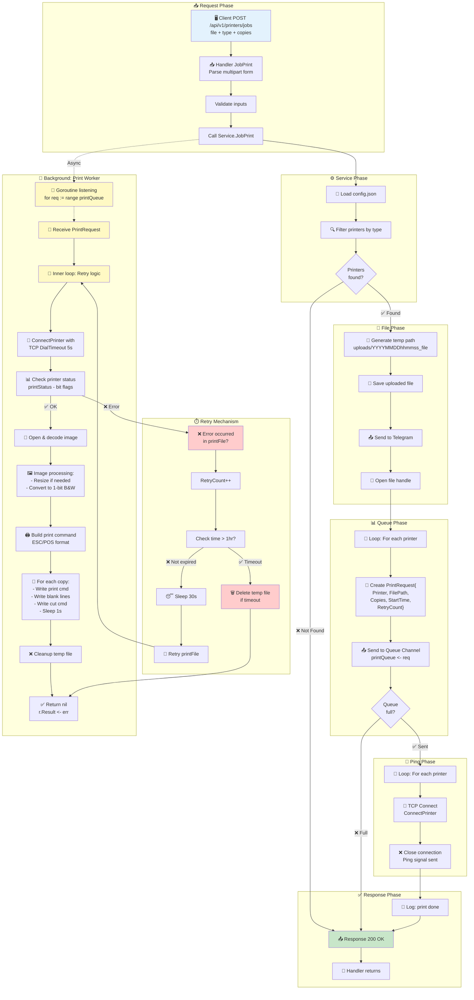
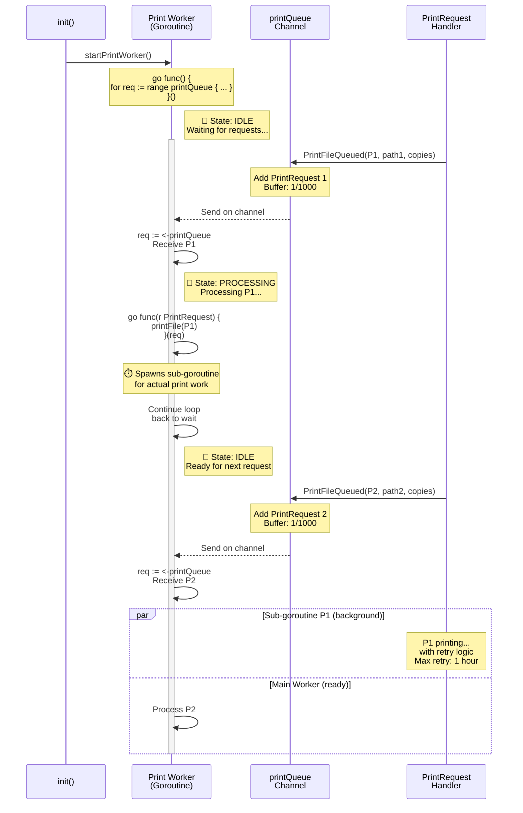
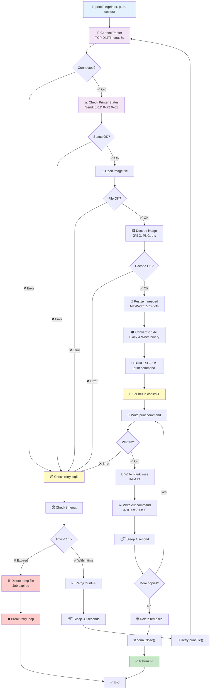
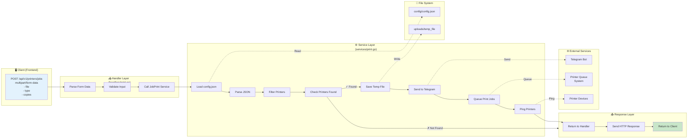
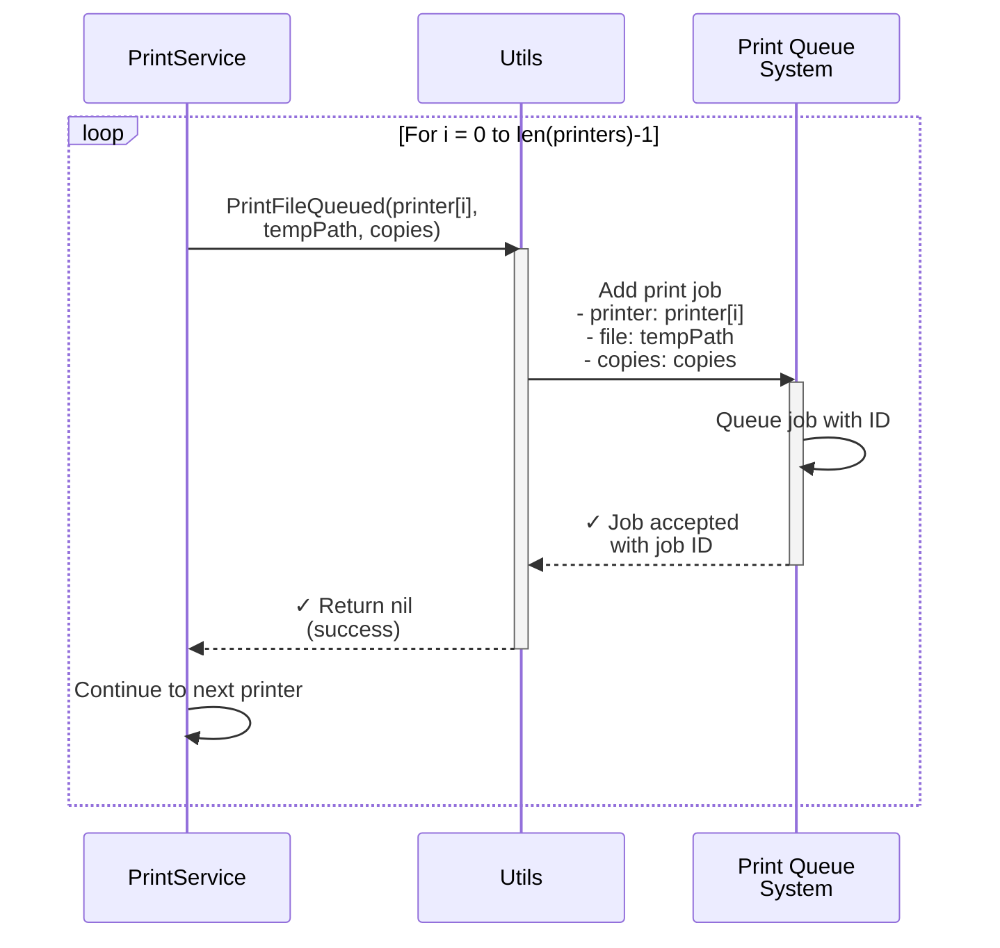
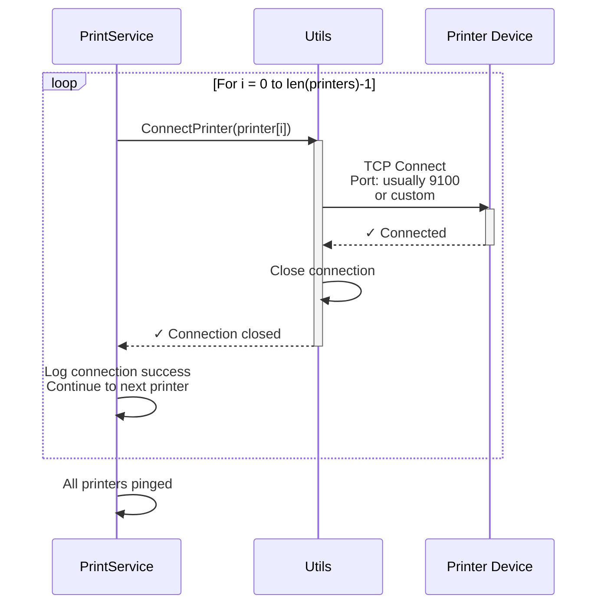

# API Job Print - Flow Diagram

## Overview

API Job Print (`POST /api/v1/printers/jobs`) là endpoint để gửi yêu cầu in một file với các thông số cụ thể.

---

## 🎯 Complete End-to-End Flow (Chi tiết nhất)

```mermaid
sequenceDiagram
    participant Client as 🖥️ Client<br/>(Frontend)
    participant Handler as 📥 Handler<br/>(JobPrint)
    participant Service as ⚙️ Service<br/>(JobPrint)
    participant Config as 📁 Config File<br/>(config.json)
    participant Utils as 🔧 Utils
    participant Queue as 📊 Print Queue<br/>(Channel: 1000)
    participant Worker as 👷 Print Worker<br/>(Goroutine)
    participant Telegram as 📤 Telegram Bot
    participant Printer as 🖨️ Printer Device

    rect rgb(200, 220, 255)
    Note over Client,Handler: STEP 1: Client Request & Validation
    Client->>Handler: POST /api/v1/printers/jobs<br/>multipart/form-data<br/>- file: binary<br/>- type: "A4"<br/>- copies: "2"

    activate Handler
    Handler->>Handler: c.MultipartForm()
    Handler->>Handler: Extract files, type, copies

    alt Files == empty
        Handler->>Client: ❌ 400 Error<br/>no_files_uploaded
        deactivate Handler
    else copies == empty
        Handler->>Handler: Set copies = "1"
    end
    end

    rect rgb(220, 255, 220)
    Note over Handler,Service: STEP 2: Load & Parse Config
    Handler->>Service: JobPrint(c, "A4", "2", file)
    activate Service

    Service->>Config: os.ReadFile("config.json")
    Config-->>Service: []byte data

    Service->>Service: json.Unmarshal()<br/>→ []PrintConfigResponse
    end

    rect rgb(255, 240, 220)
    Note over Service,Config: STEP 3: Filter Printers by Type
    Service->>Service: printers := []string{}<br/>Loop config items

    activate Service
    Service->>Service: for _, c := range config<br/>&nbsp;&nbsp;for _, t := range c.Type<br/>&nbsp;&nbsp;&nbsp;&nbsp;if t == "A4"<br/>&nbsp;&nbsp;&nbsp;&nbsp;&nbsp;&nbsp;printers += c.PrinterName

    alt len(printers) == 0
        Service-->>Handler: ❌ Error<br/>PRINT_NOT_FOUND
        Handler->>Client: ❌ 400 Error
        deactivate Service
        deactivate Handler
    else printers found
        Note right of Service: ✅ Found: ["office_printer_1",<br/>"office_printer_2"]
    end
    deactivate Service
    end

    rect rgb(255, 220, 220)
    Note over Service,Utils: STEP 4: Save File & Send to Telegram
    activate Service

    Service->>Service: now := time.Now()<br/>tempPath := "uploads/"<br/>&nbsp;&nbsp;&nbsp;&nbsp;&nbsp;&nbsp;&nbsp;&nbsp;&nbsp;&nbsp;&nbsp;&nbsp;&nbsp;&nbsp;&nbsp;&nbsp;&nbsp;&nbsp;&nbsp;&nbsp;&nbsp;&nbsp;&nbsp;&nbsp;+ "20251126150430_doc.pdf"

    Service->>Utils: c.SaveUploadedFile(file, tempPath)
    activate Utils
    Utils->>Utils: Create uploads/ directory
    Utils->>Utils: Write file to disk
    Utils-->>Service: ✅ nil (success)
    deactivate Utils

    Service->>Utils: SendFileToTelegramBot(tempPath)
    activate Utils
    Utils->>Telegram: Send POST request<br/>with file content
    Telegram-->>Utils: ✅ 200 OK
    Utils-->>Service: ✅ Done
    deactivate Utils

    Service->>Service: file.Open()<br/>→ defer f.Close()
    deactivate Service
    end

    rect rgb(220, 240, 255)
    Note over Service,Queue: STEP 5: Queue Print Jobs

    activate Service
    Service->>Service: ⏮️ First Loop:<br/>for _, printer := range printers

    loop For each printer (i=0 to len-1)
        activate Service
        Service->>Utils: PrintFileQueued(printer,<br/>tempPath, "2")
        activate Utils

        Utils->>Utils: req := PrintRequest{<br/>&nbsp;&nbsp;Printer: "office_printer_1"<br/>&nbsp;&nbsp;FilePath: "uploads/..."<br/>&nbsp;&nbsp;Copies: "2"<br/>&nbsp;&nbsp;Result: make(chan error)<br/>&nbsp;&nbsp;StartTime: now<br/>&nbsp;&nbsp;RetryCount: 0<br/>}

        Utils->>Queue: select case printQueue <- req
        activate Queue

        alt Queue not full
            Queue-->>Utils: ✅ Sent (non-blocking)
            Utils-->>Service: return nil
            deactivate Queue
        else Queue full
            Utils-->>Service: ❌ Error: QUEUE_FULL
            Service-->>Handler: Error
            Handler->>Client: ❌ 400 Error
        end

        deactivate Utils
        deactivate Service
    end

    Note right of Queue: 📊 Queue Stats:<br/>- Capacity: 1000<br/>- Current: 2<br/>- Buffered channel
    end

    rect rgb(255, 255, 200)
    Note over Service,Worker: STEP 6: Worker Processing Queue

    Note right of Worker: 👷 Print Worker (Goroutine)<br/>Started at init()

    Worker->>Queue: for req := range printQueue
    activate Worker

    Worker->>Worker: go func(r PrintRequest) {<br/>&nbsp;&nbsp;for {<br/>&nbsp;&nbsp;&nbsp;&nbsp;err := printFile(...)<br/>&nbsp;&nbsp;&nbsp;&nbsp;if err == nil break<br/>&nbsp;&nbsp;&nbsp;&nbsp;RetryCount++<br/>&nbsp;&nbsp;&nbsp;&nbsp;if time > 1h timeout<br/>&nbsp;&nbsp;&nbsp;&nbsp;&nbsp;&nbsp;os.Remove(file)<br/>&nbsp;&nbsp;&nbsp;&nbsp;&nbsp;&nbsp;break<br/>&nbsp;&nbsp;&nbsp;&nbsp;sleep 30s retry<br/>&nbsp;&nbsp;}<br/>}()

    Note right of Worker: ⏱️ Retry Logic:<br/>- Max Duration: 1 hour<br/>- Retry Interval: 30s<br/>- Auto cleanup on timeout
    end

    rect rgb(240, 200, 255)
    Note over Worker,Printer: STEP 7: Print File (DetailProcess)

    activate Worker
    Worker->>Worker: numCopies := 2<br/>byteWidth := (w + 7) / 8

    Worker->>Printer: ConnectPrinter(printer)<br/>TCP Dial Timeout: 5s
    activate Printer
    Printer-->>Worker: ✅ Connected<br/>net.Conn (TCP socket)
    deactivate Printer

    Worker->>Printer: printStatus(conn)<br/>Send: 0x1D 0x72 0x01
    activate Printer
    Printer-->>Worker: Status byte (0x00-0xFF)<br/>Check bits for errors

    alt Status != OK
        Printer-->>Worker: ❌ Error<br/>(OFFLINE, PAPER_OUT, etc)
        Worker->>Worker: return error
        deactivate Printer
    else Status OK
        Note right of Printer: ✅ Printer Status OK<br/>- 0x01: Offline<br/>- 0x02: Open<br/>- 0x04: Paper Jam<br/>- 0x08: Paper Out<br/>- 0x10: Connect Timeout<br/>- 0x20: Paper Near Out<br/>- 0x40: Cut Error<br/>- 0x80: Unknown Error
    end

    Worker->>Worker: os.Open(filePath)<br/>→ image.Decode(img)

    Worker->>Worker: img resize if w > 576<br/>MaxPrinterDots: 576

    Worker->>Worker: convertImage to<br/>1-bit binary format<br/>(Black & White)

    Worker->>Worker: buildPrintCommand()<br/>0x1D 0x76 0x30 0x00<br/>+ width bytes<br/>+ height bytes<br/>+ image data bytes

    loop For each copy (i=0 to numCopies-1)
        Worker->>Printer: conn.Write(printCmd)
        activate Printer
        Printer-->>Worker: ✅ Bytes written
        deactivate Printer

        Worker->>Printer: Write blank lines<br/>0x0A 0x0A 0x0A 0x0A
        Worker->>Printer: Write cut command<br/>0x1D 0x56 0x00

        Worker->>Worker: time.Sleep(1 * Second)
    end

    Worker->>Worker: os.Remove(tempFilePath)<br/>Delete temp file
    Worker->>Worker: conn.Close()

    Worker-->>Worker: return nil (success)
    deactivate Printer
    end

    rect rgb(200, 255, 200)
    Note over Service,Printer: STEP 8: Ping Printers

    activate Service
    Service->>Service: ⏮️ Second Loop:<br/>for _, printer := range printers

    loop For each printer (ping)
        Service->>Utils: ConnectPrinter(printer)
        activate Utils
        Utils->>Printer: TCP DialTimeout 5s<br/>to printer address
        activate Printer
        Printer-->>Utils: ✅ Connected
        deactivate Printer
        Utils-->>Service: net.Conn
        deactivate Utils

        Service->>Service: conn.Close()<br/>(Sends signal)

        Note right of Service: 📍 Purpose of Ping:<br/>- Activate printer<br/>- Wake from sleep<br/>- Connection test
    end
    deactivate Service
    end

    rect rgb(200, 220, 255)
    Note over Service,Handler: STEP 9: Response & Cleanup

    Service->>Service: log.Println("print done")
    Service-->>Handler: return nil
    deactivate Service

    activate Handler
    Handler->>Client: ✅ 200 OK<br/>{<br/>&nbsp;&nbsp;"code": "ok"<br/>&nbsp;&nbsp;"data": null<br/>&nbsp;&nbsp;"message": "OK"<br/>}
    deactivate Handler

    Note right of Client: ✅ Client receives<br/>response immediately<br/><br/>🔄 Printing happens<br/>in background via worker
    end
```

---

## Sequence Diagram

---

## Detailed Flow Steps

### 1. **Client Request**

```
POST /api/v1/printers/jobs
Content-Type: multipart/form-data

Parameters:
- file: binary file data (required)
- type: string (required) - print type to match in config
- copies: string (optional) - default "1"
```

### 2. **Handler Layer (print.go)**

- Extract form data từ request
- Validate: kiểm tra file có tồn tại không
- Set default copies = "1" nếu không có
- Gọi `printService.JobPrint()`

### 3. **Service Layer (services/print.go)**

#### Step 3.1: Load Configuration

- Đọc file `config/config.json`
- Parse JSON thành array `PrintConfigResponse`

#### Step 3.2: Filter Printers

- Lặp qua tất cả printers trong config
- Tìm những printer có `type` matching với `printType` request
- Nếu không tìm được → **Error: PRINT_NOT_FOUND**

#### Step 3.3: Save File

- Tạo filename tạm thời với timestamp: `uploads/YYYYMMDDhhmmss_filename`
- Lưu file upload vào thư mục uploads

#### Step 3.4: Send to Telegram

- Gửi file tạm thời tới Telegram Bot (logging/notification)

#### Step 3.5: Queue Print Jobs

- Lặp qua từng printer trong danh sách filter
- Gọi `utils.PrintFileQueued()` để thêm vào queue in
- File sẽ được in với số bản copies được chỉ định

#### Step 3.6: Ping Printers

- Lặp qua từng printer
- Kết nối TCP tới printer (ConnectPrinter)
- Đóng connection để gửi "ping" signal
- Mục đích: đánh thức printer hoặc kiểm tra trạng thái

#### Step 3.7: Return Response

- Log "print done"
- Return nil (no error)

### 4. **Success Response**

```json
{
  "code": "ok",
  "data": null,
  "message": "OK"
}
```

### 5. **Error Scenarios**

| Lỗi                       | Status | Nguyên nhân                                      |
| ------------------------- | ------ | ------------------------------------------------ |
| `no_files_uploaded`       | 400    | Không có file được upload                        |
| `PRINT_NOT_FOUND`         | 400    | Không tìm thấy printer nào với type được yêu cầu |
| `Failed to get form data` | 400    | Lỗi parse multipart form                         |
| `Failed to save file`     | 400    | Lỗi lưu file tạm thời                            |
| `Failed to queue print`   | 400    | Lỗi gửi file tới printer                         |

---

## Configuration Structure

### config/config.json

```json
[
  {
    "printerName": "office_printer_1",
    "type": ["A4", "color"]
  },
  {
    "printerName": "office_printer_2",
    "type": ["A3", "bw"]
  }
]
```

**Cách match:**

- Request type = "A4" → tìm tất cả printer có "A4" trong array `type`
- Kết quả: sẽ in tới `office_printer_1`

---

## 📊 Queue & Worker Processing Flow



---

## 🔄 Queue System Deep Dive

```mermaid
graph LR
    subgraph CLIENT["🖥️ Client Request"]
        R1["Request 1"]
        R2["Request 2"]
        R3["Request N"]
    end

    subgraph HANDLER["📥 Handler Layer"]
        H1["Parse & Validate"]
        H2["Call Service"]
    end

    subgraph SERVICE["⚙️ Service Layer"]
        S1["Load Config"]
        S2["Filter Printers"]
        S3["Save File"]
        S4["Loop: PrintFileQueued<br/>for each printer"]
    end

    subgraph QUEUE["📊 QUEUE CHANNEL<br/>(Buffer Size: 1000)"]
        Q1["PrintRequest 1"]
        Q2["PrintRequest 2"]
        Q3["PrintRequest 3"]
        STATS["Current: 3<br/>Max: 1000"]
    end

    subgraph WORKER["👷 Print Worker<br/>(Single Goroutine)"]
        W1["Waiting..."]
        W2["Processing<br/>Request 1"]
        W3["Processing<br/>Request 2"]
    end

    subgraph PRINTER["🖨️ Printer Operations"]
        P1["TCP Connect"]
        P2["Check Status"]
        P3["Process Image"]
        P4["Send Print Cmd"]
        P5["Wait 1s between copies"]
        P6["Send Cut Command"]
        P7["Close Connection"]
    end

    subgraph RESULT["✅ Results"]
        RES1["r.Result <- nil"]
        RES2["r.Result <- error"]
    end

    CLIENT --> HANDLER
    HANDLER --> SERVICE
    SERVICE --> S1 --> S2 --> S3 --> S4

    S4 -->|Add to Queue| QUEUE
    QUEUE -.->|Non-blocking<br/>send| QUEUE
    QUEUE -->|Channel receive| WORKER

    WORKER --> W2
    W2 --> P1 --> P2
    P2 -->|Status OK| P3 --> P4
    P4 --> P5 --> P6 --> P7
    P7 --> RES1

    P2 -->|Status Error| RES2

    W1 -.->|Waiting for<br/>next request| W3

    style QUEUE fill:#ffeb3b
    style WORKER fill:#fff9c4
    style P1 fill:#e8f5e9
    style P7 fill:#e8f5e9
    style RES1 fill:#c8e6c9
    style RES2 fill:#ffcccc
```



---

## Print Worker Lifecycle



---

## Print File Processing with Retry



---

## Complete Request Lifecycle Timeline

```mermaid
timeline
    title Job Print Request - Complete Timeline

    section Request
        T+0ms: Client sends POST request
        T+5ms: Handler parses form data
        T+10ms: Handler validates input
        T+15ms: Service.JobPrint() called

    section Config
        T+20ms: Load config.json from disk
        T+25ms: Parse JSON config
        T+30ms: Filter printers by type

    section File Operations
        T+40ms: Generate temp file path
        T+45ms: Save uploaded file
        T+50ms: Send file to Telegram
        T+55ms: Open file handle

    section Queue
        T+60ms: Loop - For each printer
        T+65ms: Create PrintRequest object
        T+70ms: Send to queue channel
        T+75ms: Handler returns immediately
        T+80ms: Client receives 200 OK response ✅

    section Ping
        T+85ms: Loop - For each printer
        T+90ms: TCP connect to printer
        T+95ms: Close connection (ping)
        T+100ms: Service returns

    section Background (Worker)
        T+70ms: Worker receives request from queue
        T+75ms: Spawn sub-goroutine for print
        T+100ms: Sub-goroutine connects to printer
        T+105ms: Check printer status
        T+110ms: Decode image file
        T+115ms: Build print command
        T+120ms: Send print command (copy 1)
        T+125ms: Sleep 1 second
        T+126ms: Send print command (copy 2)
        T+131ms: Send cut command
        T+135ms: Delete temp file
        T+140ms: Sub-goroutine completes ✅
```



---

## Flow Chart - Detailed Process


---

## State Machine Diagram

```mermaid
stateDiagram-v2
    [*] --> WaitingRequest: Client connects

    WaitingRequest --> ValidatingForm: Receive request

    ValidatingForm --> CheckFiles: Form parsed
    ValidatingForm --> FormError: Form invalid

    CheckFiles --> LoadingConfig: Files exist
    CheckFiles --> NoFilesError: No files

    LoadingConfig --> FilteringPrinters: Config loaded
    LoadingConfig --> ConfigError: Config read error

    FilteringPrinters --> PrintersFound: Printers matched
    FilteringPrinters --> NoPrintersError: No printers for type

    PrintersFound --> SavingFile: Start file operations

    SavingFile --> SendingTelegram: File saved
    SavingFile --> FileSaveError: Save failed

    SendingTelegram --> OpeningFile: Telegram sent

    OpeningFile --> QueuingJobs: File opened

    QueuingJobs --> CheckingQueue{All printers<br/>queued?}
    CheckingQueue --> QueueError: Queue failed
    CheckingQueue --> PingingPrinters: All queued

    PingingPrinters --> CheckingPing{All printers<br/>pinged?}
    CheckingPing --> PingError: Ping failed
    CheckingPing --> Success: All pinged

    Success --> Logging: Log completion
    Logging --> ResponseSuccess: Send 200 OK

    FormError --> ResponseError: Send 400 Error
    NoFilesError --> ResponseError
    ConfigError --> ResponseError
    NoPrintersError --> ResponseError
    FileSaveError --> ResponseError
    QueueError --> ResponseError
    PingError --> ResponseError

    ResponseError --> [*]
    ResponseSuccess --> [*]

    note right of LoadingConfig
        Read từ:
        ./config/config.json
    end note

    note right of FilteringPrinters
        Match printType
        với type array
        trong config
    end note

    note right of SavingFile
        Path: uploads/
        YYYYMMDDhhmmss_filename
    end note

    note right of QueuingJobs
        Gọi PrintFileQueued()
        cho mỗi printer
    end note

    note right of PingingPrinters
        TCP connection
        để activate printer
    end note
```

---

## Data Flow - Request to Response



---

## Sequence Details - Each Loop

### PrintFileQueued Loop (For Each Printer)



### Ping Loop (For Each Printer)



---

## Data Flow

```
Client Upload
    ↓
Handler receives multipart form
    ↓
Service reads config.json
    ↓
Filter printers by type
    ↓
Save temp file to uploads/
    ↓
Send to Telegram (logging)
    ↓
Queue print jobs to each printer
    ↓
Ping printers (activate)
    ↓
Return success response
```

---

## File Locations

| Loại          | Vị trí                            |
| ------------- | --------------------------------- |
| Temp files    | `uploads/YYYYMMDDhhmmss_filename` |
| Config        | `config/config.json`              |
| Device config | `config/device.json`              |

---

## Notes

1. **Copies**: Được gửi tới `PrintFileQueued()` để kiểm soát số bản in
2. **Temp Files**: Lưu với timestamp để tránh trùng tên
3. **Telegram**: Gửi file để logging hoặc monitoring
4. **Ping**: Kết nối TCP cuối cùng để đánh thức printer
5. **Default**: Nếu không có copies → mặc định in 1 bản
